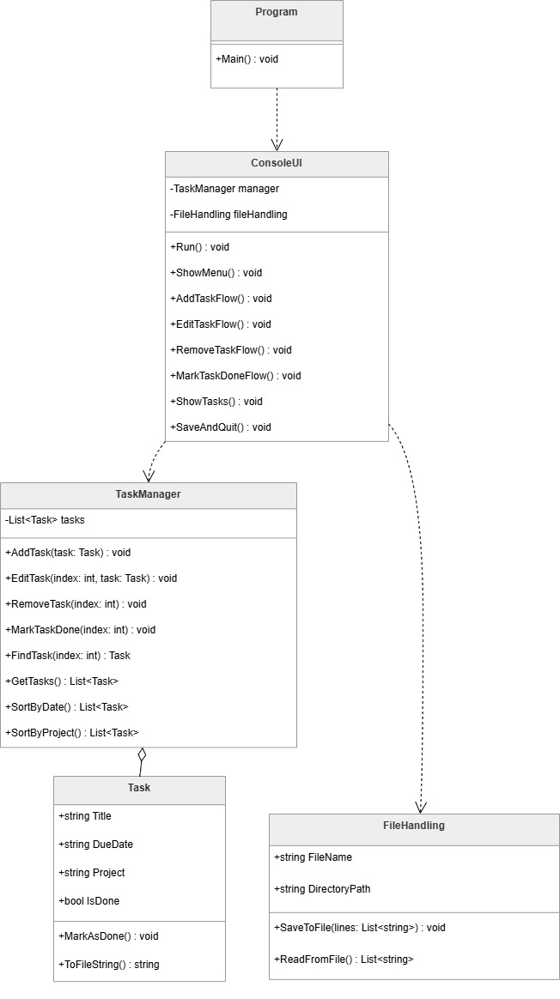

# 📝 ToDoListApp

A simple and structured C# console application for managing personal tasks.  
This project demonstrates core programming concepts such as Object-Oriented Programming (OOP), file handling, and clean code structure.

---

## 🚀 Features

- Add new tasks
- View all tasks
- Edit existing tasks
- Mark tasks as completed
- Delete tasks
- Sort tasks by date or project
- Save and load tasks from file

---

## 🛠️ Technologies

- C#
- .NET Console Application
- Object-Oriented Programming (OOP)

---

## 📂 Project Structure

The project is organized into clear components:

- `Program.cs` → Entry point of the application
- `ConsoleUI.cs` → Handles user interaction and menu logic
- `Task.cs` → Represents a task (model)
- `TaskManager.cs` → Handles task operations and business logic
- `FileHandling.cs` → Manages saving and loading data from files

---

## 📊 UML Diagram

The following diagram shows the structure and relationships between classes:



---

## ▶️ How to Run

1. Clone the repository:
```bash
git clone https://github.com/osmanosmani/ToDoListApp.git
